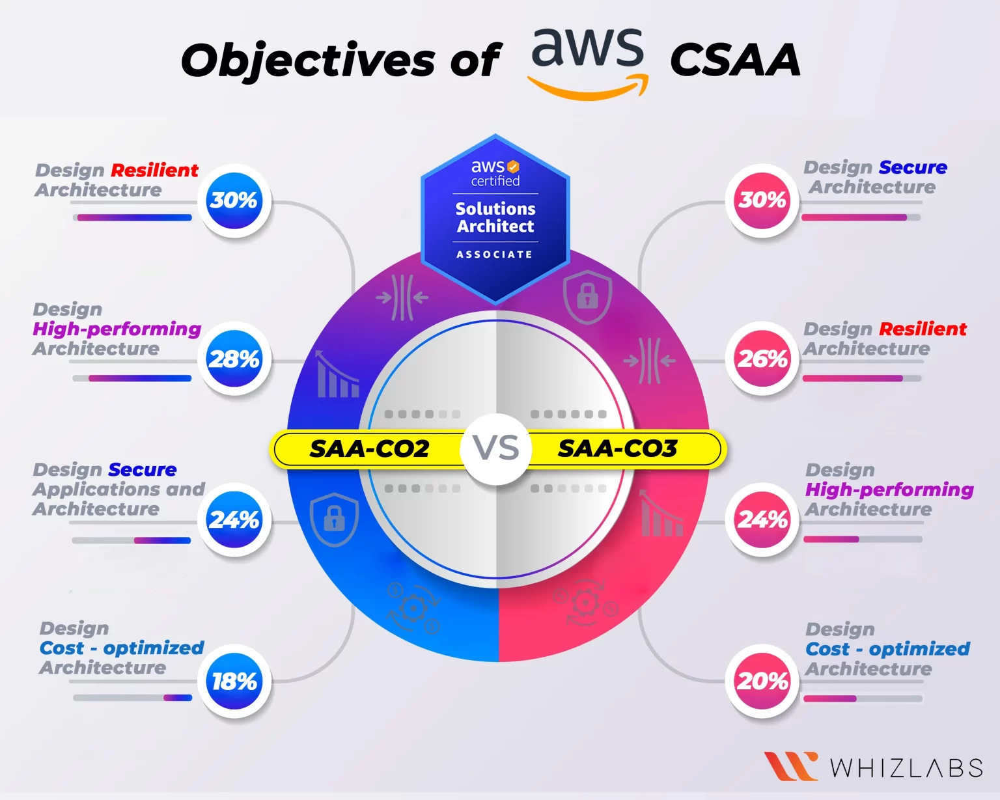
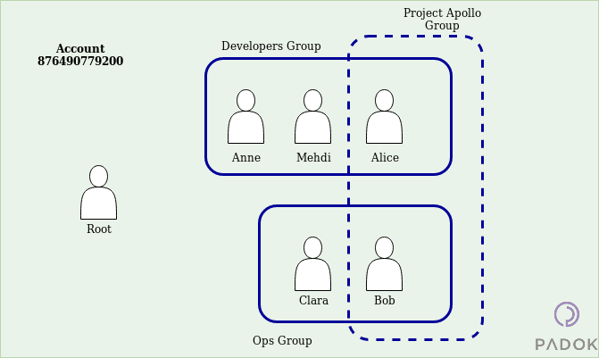
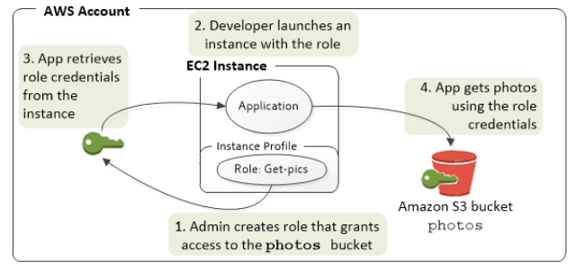
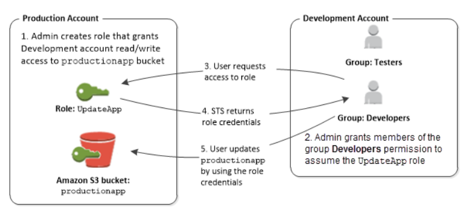
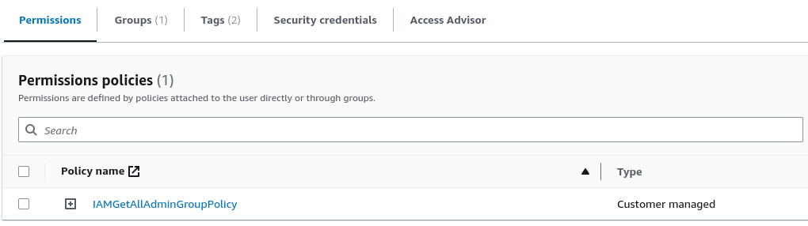
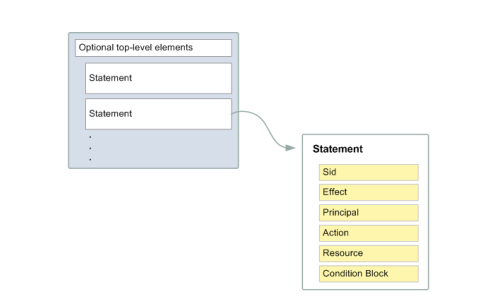
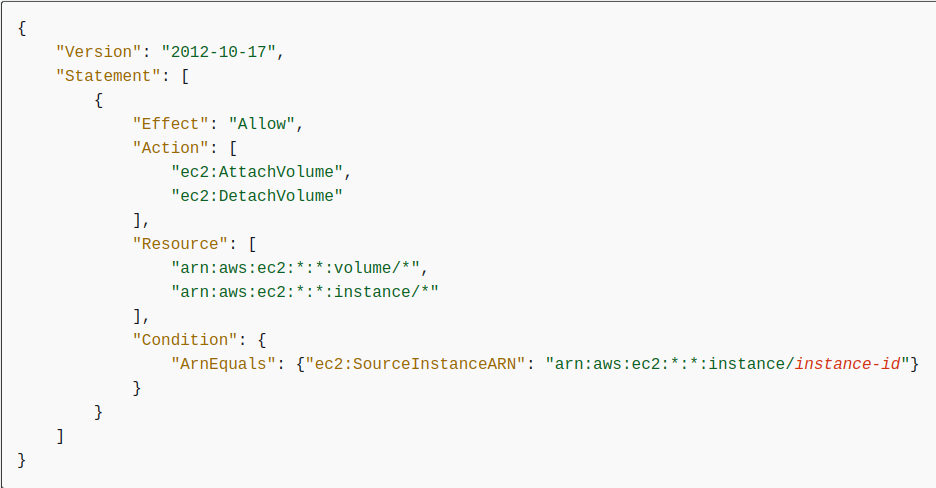

<p align="center">
  <a href="" rel="noopener">
  </a>
</p>
<h1 align="center">Learn AWS SSA 03</h1>
<p align="center"> 
This is a self-study document to prepare for the AWS SAA-03 exam.<br> 
</p>
<hr>

## 📝 Table of Contents

- [📝 Table of Contents](#-table-of-contents)
- [0️⃣ Cloud Computing](#0️⃣-cloud-computing)
- [1️⃣ AWS Overview](#1️⃣-aws-overview)
- [2️⃣ IAM Service](#2️⃣-iam-service)
  - [Components](#components)
  - [Root User](#root-user)
  - [IAM user](#iam-user)
  - [Federating existing user](#federating-existing-user)
  - [IAM Group](#iam-group)
  - [IAM Role](#iam-role)
  - [Temporary security credentials](#temporary-security-credentials)
  - [Policies](#policies)
- [3️⃣ Organization Service](#3️⃣-organization-service)
- [4️⃣ Billing Service](#4️⃣-billing-service)
- [5️⃣ EC2 Service](#5️⃣-ec2-service)
- [6️⃣ EC2 Storage, EBS Service, EFS Service and FSx Service](#6️⃣-ec2-storage-ebs-service-efs-service-and-fsx-service)
- [7️⃣ S3 Service](#7️⃣-s3-service)
- [8️⃣ Storage Gateway Service and Snow Family Service](#8️⃣-storage-gateway-service-and-snow-family-service)
- [9️⃣ VPC Service](#9️⃣-vpc-service)
- [1️⃣0️⃣ Cloudwatch service](#1️⃣0️⃣-cloudwatch-service)
- [1️⃣1️⃣ AWS Loadbalance](#1️⃣1️⃣-aws-loadbalance)
- [1️⃣2️⃣ AWS Databases](#1️⃣2️⃣-aws-databases)
- [NoSQL: DynamoDB](#nosql-dynamodb)
- [1️⃣3️⃣ On-premise strategy with AWS](#1️⃣3️⃣-on-premise-strategy-with-aws)
- [1️⃣4️⃣ Route 53](#1️⃣4️⃣-route-53)
- [1️⃣5️⃣](#1️⃣5️⃣)
- [1️⃣6️⃣](#1️⃣6️⃣)
- [1️⃣7️⃣](#1️⃣7️⃣)
- [1️⃣8️⃣](#1️⃣8️⃣)
- [1️⃣9️⃣](#1️⃣9️⃣)
- [2️⃣0️⃣](#2️⃣0️⃣)
- [2️⃣1️⃣](#2️⃣1️⃣)
- [Glossary 🔎](#glossary-)

## 0️⃣ Cloud Computing
There are four main Cloud Deployment Models:
- Public Cloud
- Private Cloud
- Community Cloud
- Hybrid Cloud

These refer to the size, placement, and access level of a cloud environment. They aren’t the same as the service models –(SaaS), (PaaS), or (IaaS). You can read more in [The National Institute of Standards and Technology (NIST) defines](https://nvlpubs.nist.gov/nistpubs/SpecialPublications/NIST.SP.500-291r2.pdf)

There are three Cloud Computing Service Models:
- Infrastructure As A Service (IaaS)
- Platform As A Service (PaaS)
- Software As A Service (SaaS)

## 1️⃣ AWS Overview
**AWS Introduction:**
- AWS (Amazon Web Services) is a Cloud Provider (public cloud services)
- Providing servers & services that you can use on demand and scale easily
- Revolution IT over time
- Famous websites use AWS: Amazon.com, Netflix, Facebook, Twitch, ...

**AWS Use Cases:**
- AWS enables you to build sophisticated, scalable applications
- Backup & Storage, Big Data analytics
- Website hosting, Mobile & Social Apps
- Gaming
- Machine learning, AI Application ...

**AWS certification:**
- Required:
  - Basic IT knowledge (Programming, Devops, Sysops)
  - English reading skill
- Cover over 30 common AWS Services.

**AWS Global Infrastructure:**
- Regions:
  - Is a cluster of data centers
  - AWS has Regions all around the world
  - Most AWS services are region-scoped

- Availability Zones (AZ):
  - Each region has many availability zones (2 -> 6 zones per region)
  - Each AZ is one or more discrete data centers with redundant power, networking, and connectivity
  - They’re separate from each other (isolated from disasters)
  - They’re connected with high bandwidth, ultra-low latency networking

- Edge locations:
  - Edge Locations using for caching content which is delivered to end users with lower latency

- Edge locations > AZs > Regions

## 2️⃣ IAM Service
**IAM is Stands for Identity and Access Management:**
- Is a service to help control access to AWS resources
- All billing of IAM User will be charged to root account
- It is Global service and Price is free

</a>

### Components
- Identities:
  - Users: Root User, IAM User, Federating existing user
  - IAM Group
  - IAM Role / Temporary security credentials
- Policies and permissions ([More details](https://docs.aws.amazon.com/IAM/latest/UserGuide/access_policies.html))

### Root User
**Login with:**
- Email & password for Web UI
- Access key for programming
- Full Permissions

**Some tasks can perform only by the root user:**
- Change your account settings
- Close your AWS account
- Restore IAM user permissions
- Configure an Amazon S3 bucket to enable MFA
- Activate IAM access to the Billing and Cost Management console
- [More tasks only root user tasks](https://docs.aws.amazon.com/accounts/latest/reference/root-user-tasks.html)

**Best Practices:**
- Limit the tasks you perform with the root user
- Should create MFA and remove access key (avoid hacker scan)
- Create an administrative user in AWS IAM Identity Center for daily tasks. [More details about this](https://docs.aws.amazon.com/singlesignon/latest/userguide/getting-started.html)
- Get notified when root user is used. [More details about this](https://dev.to/aws-builders/tracking-and-notifying-on-aws-sign-in-activities-31el)

### IAM user
**Access with:**
- Console password for the AWS Management Console
- Access key for programming
- SSH keys for use with CodeCommit
- Server certificates (SSL/TLS) with some AWS services

**Best Practices:**
- Each IAM user can represent a person, application, service
- Long term

### Federating existing user
- Login via Single Sign-On (SSO) -> don’t create IAM User
- Use Session Role to define permission

**Usecases:**
- Login with Amazon, Facebook, Google, any OpenID Connect (OIDC), ...
- Login with company’s account

</a>

### IAM Group
- There can be many IAM Groups in 1 Root user
- A user can belong to many groups

**Best Practices:**
  - Each user in the group usually has the same policy
  - Ex: project, department, position, ...

</a>

### IAM Role
- No username & password, access key
- Is a set of policies
- Can be reuse

**Usecases:**
- Grant permission for:
  - AWS Service
  - Other Account (Not for IAM User, IAM Group), 3rd party
  - Federating existing users, Web Identity
- Allows AWS services (EC2, Lambda, ...) to execute actions on behalf of the root user

</a>

- Allow other accounts or 3rd party to access resources

</a>

- Web Identity (use for Cognito or OpenID)
- SAML 2.0 federation (use for corporate directory, SSO)

### Temporary security credentials
- It is a temporary credentials, which automatically expires after a period of time
- Similar to Role but cannot reuse
- Generated from AWS Security Token Service (AWS STS)

**Usecases:**
- Short-term
- Use in conjunction with Federating existing user for single sign-on login

### Policies
- Contains permissions that determine whether the request is allowed or denied
- JSON
- Attach to multiple Identities & AWS resources
- Can merge multiple policies together
- Deny has priority higher than Allow
- When attaching policy to resource, identity, the policy will become permission

</a>

**Structure:**
- Version: version of policy
- Sid: statement ID
- Effect: allow/deny
- Principal: identity
- Action/NotAction
- Resource: AWS resources ARN
- Condition: condition for AWS resources

</a>

**Example policy:** 
- Allows an Amazon EC2 instance to attach or detach volumes

</a>

- [More example](https://docs.aws.amazon.com/IAM/latest/UserGuide/access_policies_examples.html)

**Policy types**
- Identity-based policies: Attach managed and inline policies to IAM identities
- Resource-based policies: Attach inline policies to resources
- Permissions boundaries: the permissions boundary for an IAM entity
- Organizations SCPs: define the maximum permissions for account members of an organization or organizational unit (OU)
- Access control lists (ACLs)
- Session policies


## 3️⃣ Organization Service

## 4️⃣ Billing Service

## 5️⃣ EC2 Service

## 6️⃣ EC2 Storage, EBS Service, EFS Service and FSx Service

## 7️⃣ S3 Service

## 8️⃣ Storage Gateway Service and Snow Family Service

## 9️⃣ VPC Service
- Elastic ip co the gan vao private instance nhung vo nghia vi root table khong cho phep ra ngoai internet
- Organization network = private network

## 1️⃣0️⃣ Cloudwatch service
Cloudwatch service co the duoc thay the bang opensearch (elasticsearch)

## 1️⃣1️⃣ AWS Loadbalance
- Application loadbalance
- Performane tunnil

## 1️⃣2️⃣ AWS Databases
Relational Database Service:
- RDS vs DB on EC2:
- Chi scale out chu khong scale in duoc
Aurora: mysql (5.7) and postgres (12)
https://aws.amazon.com/blogs/mt/establishing-rpo-and-rto-targets-for-cloud-applications/
RDS Proxy:
- Cross region Aurora => khong tao 1 replias moi ma la tao 1 Aurora moi
- Cluster Volume

- App hiện đại không đẩy function, tính toán xuống database => tính toán phía app => database không nặng tính toán, thường tính theo RAM.

Serverless:
- Bài thi AWS thường hướng đến các management service mà họ xậy dựng lên

NoSQL: DynamoDB
- 


## 1️⃣3️⃣ On-premise strategy with AWS
- DataSync service: Chi sync nhung thay doi len AWS storage
- Transder Family Service: 
  - Support protocol: SFTP,..
- Snow family:
- VM Import/Export: Mirgate VM ton on-premises to EC2
- Mirgation Hub: 
- Mô hình three tie
- Ưu tiên: Serverless service => Managed service => ec2
- 

## 1️⃣4️⃣ Route 53
Dung lai phan Components route 53
- Name server: 2 loai: public name server va private name server
  - Mac dinh ho cung cap 4 name server
  - hosted zone: SOA la gi
- CNAME dung de redirect sang url khac: app.dogoo.vn => web.dogoo.vn
- Failover Routing
- Routing Policy
- trafic flow

Cloud front
Beanstalk


## 1️⃣5️⃣
KMS: Lưu trữ key dung cho việc mã hóa S3, EFS, ... loại là At-rest
2 loai ma hoa: symmetric va asymmetric

## 1️⃣6️⃣

## 1️⃣7️⃣

## 1️⃣8️⃣

## 1️⃣9️⃣

## 2️⃣0️⃣

## 2️⃣1️⃣

## Glossary 🔎
- Amazon Resource Names (ARNs): uniquely identify AWS resources across all of AWS. The general format for an ARN looks like this:
```
arn:partition:service:region:account-id:resource-id
arn:partition:service:region:account-id:resource-type/resource-id
arn:partition:service:region:account-id:resource-type:resource-id
```
- Standalone policy: the policy has its own Amazon Resource Name (ARN) that includes the policy name. For example, `arn:aws:iam::aws:policy/IAMReadOnlyAccess` is an AWS managed policy.