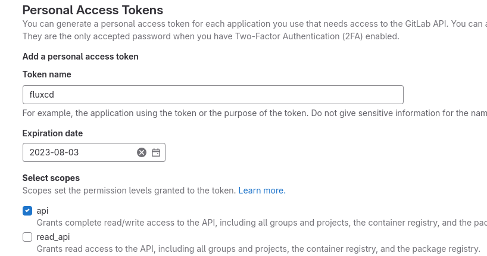
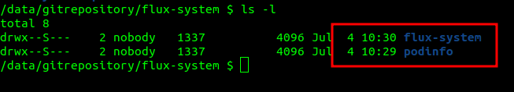

<p align="center">
  <a href="" rel="noopener">
 </a>
</p>
<h1 align="center">Learn Flux cd</h3>
<p align="center">
This is a self-study document about flux cd.<br> 
</p>

## 📝 Table of Contents

- [📝 Table of Contents](#-table-of-contents)
- [1️⃣ Introduction](#1️⃣-introduction)
- [2️⃣ GitOps Toolkit](#2️⃣-gitops-toolkit)
- [3️⃣ Core Concepts](#3️⃣-core-concepts)
  - [GitOps](#gitops)
  - [Sources](#sources)
  - [Reconciliation](#reconciliation)
  - [Kustomization](#kustomization)
  - [Bootstrap](#bootstrap)
  - [Continuous Delivery](#continuous-delivery)
  - [Continuous Deployment](#continuous-deployment)
  - [Progressive Delivery](#progressive-delivery)
- [4️⃣ Quick start in local env](#4️⃣-quick-start-in-local-env)
  - [Install kubernetes](#install-kubernetes)
  - [Create GitLab personal access token](#create-gitlab-personal-access-token)
  - [Run flux bootstrap](#run-flux-bootstrap)
  - [Clone the git repository](#clone-the-git-repository)
  - [Add podinfo repository to Flux](#add-podinfo-repository-to-flux)
  - [Deploy podinfo application](#deploy-podinfo-application)
  - [Watch Flux sync the application](#watch-flux-sync-the-application)
  - [Suspend updates](#suspend-updates)
  - [Customize podinfo deployment](#customize-podinfo-deployment)
- [🔎 Glossary](#-glossary)

## 1️⃣ Introduction
Flux is a tool for keeping Kubernetes clusters in sync with sources of configuration (like Git repositories and OCI artifacts), and automating updates to configuration when there is new code to deploy.

Flux v2 is constructed with the GitOps Toolkit, a set of composable APIs and specialized tools for building Continuous Delivery on top of Kubernetes.

## 2️⃣ GitOps Toolkit
The GitOps Toolkit is the set of APIs and controllers that make up the runtime for Flux v2.

The APIs comprise Kubernetes custom resources, which can be created and updated by a cluster user, or by other automation tooling.

</a>

## 3️⃣ Core Concepts
### GitOps
GitOps is a way of managing your infrastructure and applications that: 
- Whole system is described declaratively and version controlled (most likely in a Git repository).
- Having an automated process that ensures that the deployed environment matches the state specified in a repository.

### Sources
A Source defines the origin of a repository containing the desired state of the system and the requirements to obtain it.

Sources produce an artifact that is consumed by other Flux components to perform actions, like applying the contents of the artifact on the cluster.

A source may be shared by multiple consumers to deduplicate configuration.

The origin of the source is checked for changes on a defined interval, if there is a newer version available that matches the criteria, a new artifact is produced.

</a>

All sources are specified as Custom Resources in a Kubernetes cluster, examples of sources are GitRepository, OCIRepository, HelmRepository and Bucket resources.

### Reconciliation
Reconciliation refers to ensuring that a given state (e.g. application running in the cluster, infrastructure) matches a desired state declaratively defined somewhere (e.g. a Git repository).
There are various examples of these in Flux:
- `HelmRelease` reconciliation: ensures the state of the Helm release matches what is defined in the resource.
- `Bucket` reconciliation: downloads and archives the contents of the declared bucket on a given interval and stores this as an artifact.
- `Kustomization` reconciliation: ensures the state of the application deployed on a cluster matches the resources defined in a Git or OCI repository or S3 bucket.

### Kustomization
It is a local set of Kubernetes resources (e.g. kustomize overlay) that Flux is supposed to reconcile in the cluster.

The reconciliation runs every five minutes by default, but this can be changed with .spec.interval.

If you make any changes to the cluster using kubectl edit/patch/delete, they will be promptly reverted. You either suspend the reconciliation or push your changes to a Git repository.

### Bootstrap
The process of installing the Flux components in a GitOps manner is called a bootstrap.
- The manifests are applied to the cluster.
- A GitRepository and Kustomization are created for the Flux components.
- The manifests are pushed to an existing Git repository (or a new one is created)

Flux can manage itself just as it manages other resources.

### Continuous Delivery
Continuous Delivery refers to the practice of delivering software updates frequently and reliably.

### Continuous Deployment
Continuous Deployment is the practice of automatically deploying code changes to production once they have passed through automated testing.

### Progressive Delivery
It builds on Continuous Delivery by gradually rolling out new features or updates to a subset of users, allowing developers to test and monitor the new features in a controlled environment and make necessary adjustments before releasing them to everyone.

Developers can use techniques like feature flags, canary releases, and A/B testing to minimize the chances of introducing bugs or errors that could harm users or interrupt business operations. 

The Flux project offers a specialised controller called Flagger that implements various progressive delivery techniques.

## 4️⃣ Quick start in local env
### Install kubernetes
I used Kind to install Kubernetes with 1 master and 2 workers.
```
[ $(uname -m) = x86_64 ] && curl -Lo ./kind https://kind.sigs.k8s.io/dl/v0.20.0/kind-linux-amd64
chmod +x ./kind
sudo mv ./kind /usr/local/bin/kind
kind create cluster --name cluster01 --config resources/kind/cluster-ha-demo.yaml
kubectl create -f resources/kind/tigera-operator.yaml
kubectl create -f resources/kind/calico.yaml
kubectl apply -f resources/kind/nginx-ingress-deploy.yaml
bash resources/kind/HAProxy.sh
```

### Create GitLab personal access token
Generate a personal access token that grants complete read/write access to the GitLab API.

</a>
```
export GITLAB_TOKEN=<your-token>
```

### Run flux bootstrap
```
flux bootstrap gitlab \
  --owner=<gitlab-username> \
  --repository=fleet-infra \
  --branch=master \
  --path=clusters/cluster01 \
  --token-auth \
  --personal
```
The bootstrap command above does the following:
- Creates a git repository fleet-infra on your Gitlab account.
- Adds Flux component manifests to the repository.
- Deploys Flux Components to your Kubernetes Cluster.
- Configures Flux components to track the path /clusters/cluster01 in the repository.

### Clone the git repository
Clone the fleet-infra repository to your local machine:
```
mkdir -p ~/workspace/fluxcd
cd ~/workspace/fluxcd
git clone git@gitlab.com:<username>/fleet-infra.git
cd fleet-infra
```

### Add podinfo repository to Flux
This example uses a public repository [podinfo](https://github.com/stefanprodan/podinfo), a tiny web application made with Go.
- Create a GitRepository manifest pointing to podinfo repository’s master branch:
```
flux create source git podinfo \
  --url=https://github.com/stefanprodan/podinfo \
  --branch=master \
  --interval=30s \
  --export > ./clusters/cluster01/podinfo-source.yaml
```

- Commit and push the `podinfo-source.yaml` file to the `fleet-infra` repository:
```
git add -A && git commit -m "Add podinfo GitRepository"
git push
```
- Check logs of pod source-controller, you will see:
```
{"level":"info","ts":"2023-07-04T10:29:55.043Z","msg":"stored artifact for commit 'Add podinfo GitRepository'","controller":"gitrepository","controllerGroup":"source.toolkit.fluxcd.io","controllerKind":"GitRepository","GitRepository":{"name":"flux-system","namespace":"flux-system"},"namespace":"flux-system","name":"flux-system","reconcileID":"3a127e3e-23e2-4035-91fb-914bd61bcb68"}

{"level":"info","ts":"2023-07-04T10:29:58.851Z","msg":"stored artifact for commit 'Merge pull request #274 from stefanprodan/alpine-3...'","controller":"gitrepository","controllerGroup":"source.toolkit.fluxcd.io","controllerKind":"GitRepository","GitRepository":{"name":"podinfo","namespace":"flux-system"},"namespace":"flux-system","name":"podinfo","reconcileID":"0af3d8ba-b00c-4999-be09-1ab249bb72c5"}
```
- In the source-controller, we will see:

</a>

### Deploy podinfo application
Configure Flux to build and apply the `kustomize` directory located in the podinfo repository.
- Use the `flux create` command to create a `Kustomization` that applies the podinfo deployment.
```
flux create kustomization podinfo \
  --target-namespace=default \
  --source=podinfo \
  --path="./kustomize" \
  --prune=true \
  --interval=5m \
  --export > ./clusters/cluster01/podinfo-kustomization.yaml
```
- Commit and push the Kustomization manifest to the repository:
```
git add -A && git commit -m "Add podinfo Kustomization"
git push
```

### Watch Flux sync the application 
- Use the flux get command to watch the podinfo app.
```
flux get kustomizations --watch
```
- The output is similar to:
```
NAME       	REVISION            	SUSPENDED	READY	MESSAGE                                
flux-system	master@sha1:0091085c	False    	True 	Applied revision: master@sha1:0091085c	
podinfo	    master@sha1:dd3869b1	False	    True	Applied revision: master@sha1:dd3869b1	
```

- Check podinfo has been deployed on your cluster:
```
kubectl -n default get deployments,services
```
- The output is similar to:
```
NAME                      READY   UP-TO-DATE   AVAILABLE   AGE
deployment.apps/podinfo   2/2     2            2           13m

NAME                 TYPE        CLUSTER-IP       EXTERNAL-IP   PORT(S)             AGE
service/kubernetes   ClusterIP   10.96.0.1        <none>        443/TCP             6h51m
service/podinfo      ClusterIP   10.104.232.239   <none>        9898/TCP,9999/TCP   13m
```

Changes made to the podinfo Kubernetes manifests in the master branch are reflected in your cluster.
- Kubernetes manifest is removed from the podinfo repository => Flux removes it from your cluster.
- Delete a Kustomization from the fleet-infra repository => Flux removes all Kubernetes objects previously applied from that Kustomization.
- Edit the podinfo deployment using kubectl edit, the changes are reverted to match the state described in Git.

### Suspend updates
- To suspend updates for a kustomization, run the command `flux suspend kustomization <name>`
- To resume updates run the command `flux resume kustomization <name>`

### Customize podinfo deployment
To customize a deployment from a repository you don’t control, you can use [Flux in-line patches](https://fluxcd.io/flux/components/kustomize/kustomization/#patches). Example:
- Add the following to the field spec of your podinfo-kustomization.yaml file:
```
  patches:
    - patch: |-
        apiVersion: autoscaling/v2beta2
        kind: HorizontalPodAutoscaler
        metadata:
          name: podinfo
        spec:
          minReplicas: 3             
      target:
        name: podinfo
        kind: HorizontalPodAutoscaler
```
- Commit and push the podinfo-kustomization.yaml changes:
```
git add -A && git commit -m "Increase podinfo minimum replicas"
git push
```
- After the synchronization finishes, running kubectl get pods should display 3 pods.

## 🔎 Glossary 
- OCI artifacts: OCI artifacts are any arbitrary files related to a software application. A common use case for OCI artifacts is Helm charts.